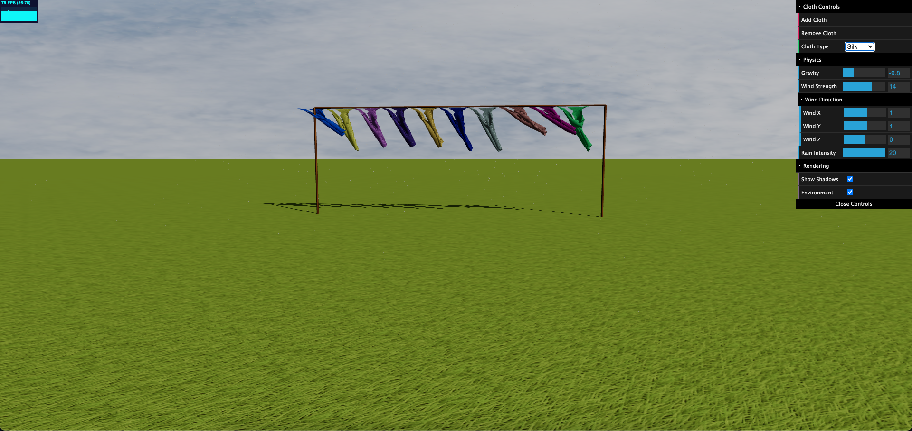

# Mass-Spring Cloth Simulator <!-- omit from toc -->

A 3D simulation of cloth physics using the mass-spring model, created with Three.js. This simulator visualizes the physical behaviour of cloth under environmental forces such as gravity, wind, and rain. The project includes interactive controls to modify cloth properties, environment, and physics parameters in real time.

## Table of Contents <!-- omit from toc -->

- [What is Mass-Spring Cloth Simulator?](#what-is-mass-spring-cloth-simulator)
- [Math Involved](#math-involved)
- [Code Implementation](#code-implementation)
- [Core Features](#core-features)
- [Main Three.js Components Used](#main-threejs-components-used)
- [Conclusions](#conclusions)
- [Usage](#usage)

## What is Mass-Spring Cloth Simulator?

The Mass-Spring Cloth Simulator is a physics-based system for representing and manipulating cloth-like materials in a virtual environment. This simulator treats cloth as a grid of particles (masses) connected by springs, each reacting to forces such as gravity, wind, and rain. By adjusting the parameters of these forces, users can explore how different materials behave under varying conditions.

## Math Involved

The simulator models cloth dynamics using the following mathematical components:

- **Mass-Spring Model**: The cloth is represented as a grid of mass points (particles) connected by springs. Each particle experiences forces from its neighboring particles, simulating the stretching, bending, and shearing properties of fabric.
- **Verlet Integration**: Used to calculate the position of each particle based on its current velocity and acceleration, providing realistic motion over time.
- **Constraints**: Ensures particles maintain fixed distances based on the spring properties, preserving the cloth's shape.
- **Force Calculations**: Each particle experiences:
  - **Gravity**: A constant force pulling particles downward.
  - **Wind**: A directional force that applies pressure on the cloth surface, interacting with cloth-specific wind resistance.
  - **Rain**: Adds mass to particles, simulating water absorption and making cloth heavier.

## Code Implementation

The code is structured into two main files:
  
- **index.html**: Sets up the HTML structure and includes external dependencies, such as Three.js, OrbitControls, Stats.js, and dat.GUI.
- **main.js**: The core script that defines simulation parameters, initializes the Three.js scene, and manages cloth physics and environment settings.

### Key Implementation Details in `main.js`

1. **Simulation Parameters**: Defines gravity, wind strength and direction, rain intensity, and cloth properties for materials like Silk, Cotton, and Denim.
2. **Scene Setup**: Creates a Three.js scene with lights, environment mapping, and camera settings.
3. **Cloth Mechanics**:
   - **Particle and Constraint Creation**: Each cloth segment is divided into particles connected by constraints.
   - **Environmental Force Application**: Forces like wind, rain, and gravity dynamically affect each particle.
   - **Interaction**: Clicking on a cloth instance displays an overlay with cloth-specific parameters.
4. **Animation Loop**: Continuously updates the cloth's state and renders the scene.

## Core Features

- **Physics-Based Cloth Dynamics**: Realistic cloth behavior achieved through mass-spring modeling.
- **Adjustable Environmental Forces**: Real-time control of gravity, wind, and rain parameters via a GUI.
- **Interactive Cloth Materials**: Choose from different materials, each with unique properties for wind resistance, stiffness, and water absorption.
- **User-Friendly Interface**: GUI allows users to add or remove cloth instances and adjust simulation parameters easily.
- **Detailed Rendering**: Includes shadow casting, environment mapping, and a rain particle system for visual realism.

## Main Three.js Components Used

- **THREE.Scene**: The central 3D space where all objects are added.
- **THREE.PerspectiveCamera**: Provides a viewpoint that mimics human vision.
- **THREE.WebGLRenderer**: Renders the scene using WebGL.
- **THREE.OrbitControls**: Allows user interaction for camera manipulation.
- **THREE.AmbientLight and THREE.DirectionalLight**: Create realistic lighting and shadows for the scene.
- **THREE.MeshStandardMaterial**: Materials used for objects with realistic shading.
- **dat.GUI**: Provides a user interface to modify simulation parameters in real-time.

## Conclusions

The Mass-Spring Cloth Simulator offers a visually and physically engaging experience, showcasing the behavior of cloth in various environmental conditions. By modeling fabrics as mass-spring systems, the project captures essential cloth dynamics and provides an interactive means of visualizing and experimenting with different materials. Future improvements could include more material types, finer control over simulation parameters, and integration with real-world physics engines.

## Usage

1. **Clone or simply Download this Repository**
2. **Install live-server Globally (if not already installed):** `npm install -g live-server`
3. **Navigate to Your Project Directory:** `cd path/to/your/project`
4. **Start live-server:** `live-server`